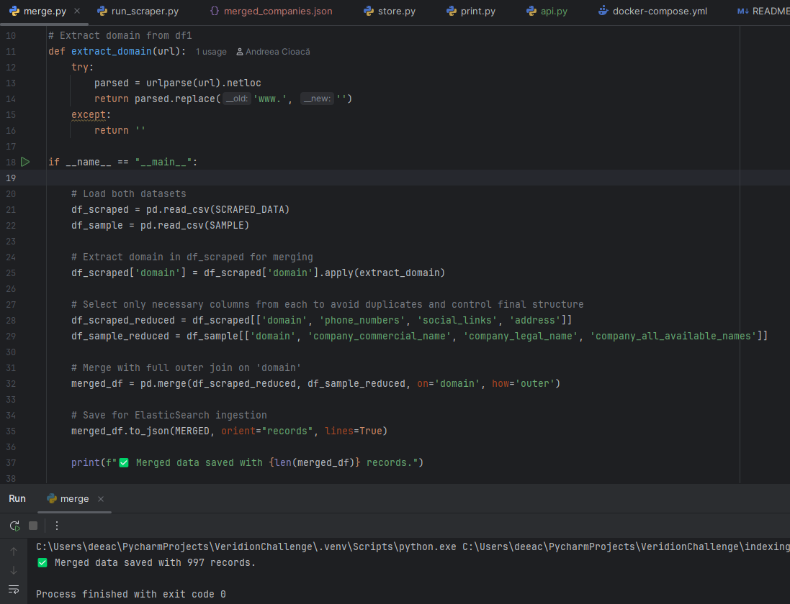
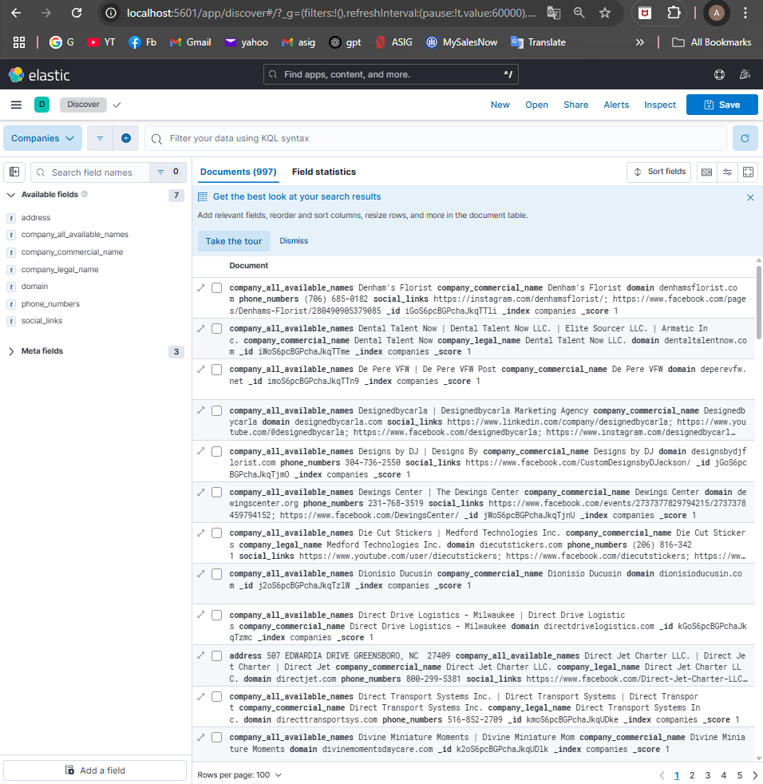
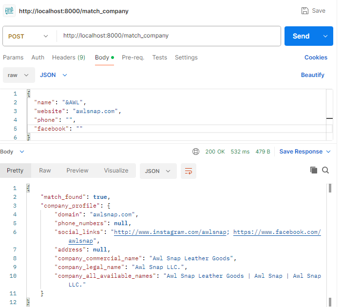
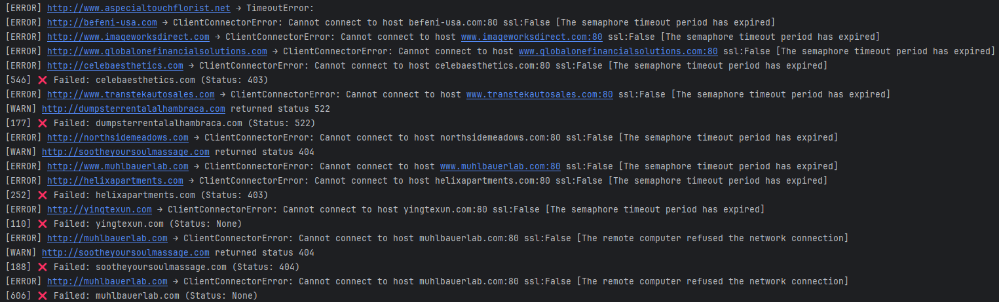

# 🏢 Company Data Extraction & Matching API

This project is a pipeline for scraping, analyzing, storing, and querying company data from a list of websites. It uses web scraping, Elasticsearch, and a FastAPI backend to expose a powerful matching API.

---

## 🚀 Setup Instructions

### 1. Clone the Repository

git clone https://github.com/deeacioaca/VeridionChallenge.git

### 2. Create a Virtual Environment 
python -m venv .venv
source .venv/bin/activate  # On Windows: .venv\Scripts\activate

### 3. Install Dependencies
pip install -r requirements.txt

## 🛠️ Running the Pipeline
Execute the following steps in order to scrape, store, and run the API:

### 🔍 Scrape Company Data

python run_scraper.py

- My result:

### 📊 2. Analyze Scraping Results

python analyze_scrape.py

### 🔗 3. Merge with Company Names

python merge.py

- My result:

### 🐳 4. Start Docker for Elasticsearch
Make sure Docker is installed and running. Then, start the Elasticsearch container:

docker-compose up -d

Elasticsearch will be available at:
http://localhost:9200

Kibana will be available at:
http://localhost:5601

### 🖨️ 6. Print and Inspect Stored Data (optional)

python print.py

### 🌐 7. Start the FastAPI Server

python api.py

The REST API will be available at:
http://localhost:8000

You can now POST to /match_company with:

- name
- website
- phone
- facebook

The API will respond with the best-matching company profile based on your input.

- My result using Postman:

## ✨ Andreea's thought process

Building a high-performance web scraping system at scale required tackling both architectural and runtime efficiency challenges. Initially, the scraper used `ThreadPoolExecutor` for concurrency, but due to Python’s Global Interpreter Lock (GIL), this approach was inefficient for I/O-bound tasks like HTTP requests. The system was slow, taking over 30 minutes for a modest list of domains.

To overcome this, I transitioned to an asynchronous architecture using `asyncio` and `aiohttp`. This change enabled thousands of requests to run concurrently without blocking, bringing the total runtime down to about **5–6 minutes** and improving resource usage.

### ⚙️ Performance Tuning

I experimented with different concurrency and timeout settings:

- **10 requests & 20s timeout** → 500 failures in 174s  
- **20 requests & 60s timeout** → 312 failures in 438s  
- **20 requests & 45s timeout** → 305 failures in 361s  

The last configuration struck the best balance between speed and reliability.

### 🛡️ Resiliency Enhancements

- **User-Agent rotation** was implemented to mimic real browsers and reduce bot detection.
- While **proxy rotation** was considered, it was postponed due to increased complexity.
- The `try_fetch_with_fallback()` function was introduced to test multiple URL formats (`http`, `https`, `www`) for better domain resolution.

### 🔁 Fault Tolerance & Robustness

- **Exponential backoff** for retries reduced issues caused by rate limits and slow servers.
- **Redirects and cookie banners** were handled gracefully using `aiohttp` session features.
- Although fetching `/sitemap.xml` and contact pages was explored, it was ultimately removed due to redundancy and inconsistency.

### 📊 Observability

Structured logging and real-time error tracking were instrumental in identifying and fixing issues. Timeout errors were the most frequent, leading to increased timeout thresholds that improved success rates.

---

This iterative and data-driven approach transformed the scraper into a robust, scalable pipeline capable of operating reliably across a variety of websites and network conditions.